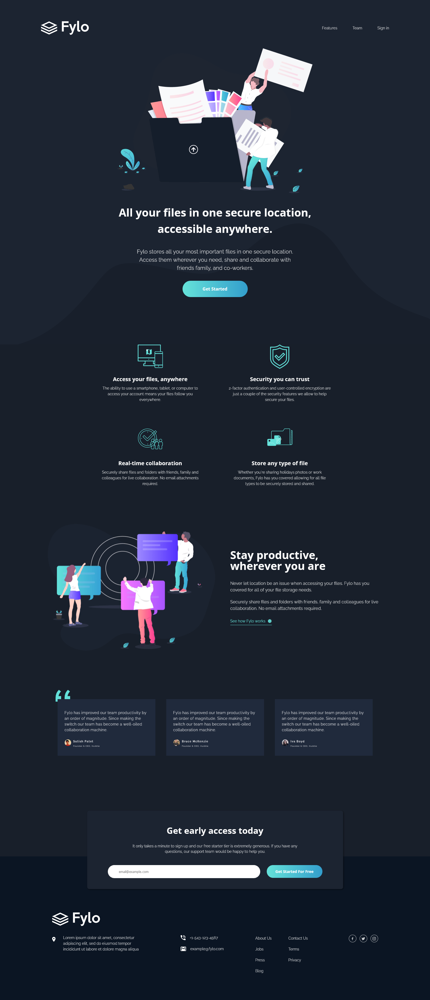

# Frontend Mentor - Fylo dark theme landing page solution

This is a solution to the [Fylo dark theme landing page challenge on Frontend Mentor](https://www.frontendmentor.io/challenges/fylo-dark-theme-landing-page-5ca5f2d21e82137ec91a50fd). Frontend Mentor challenges help you improve your coding skills by building realistic projects.

## Table of contents

- [Getting started](#getting-started)
  - [For development](#for-development)
  - [Build for production](#build-for-production)
- [Overview](#overview)
  - [The challenge](#the-challenge)
  - [Screenshot](#screenshot)
  - [Links](#links)
- [My process](#my-process)
  - [Built with](#built-with)
  - [What I learned](#what-i-learned)
  - [Continued development](#continued-development)
  - [Useful resources](#useful-resources)
- [Author](#author)
- [Acknowledgments](#acknowledgments)

## Getting started

### For development

1. Install the dependencies:

```bash
npm install
```

2. Launch the development server:

```bash
npm run dev
```

### Build for production

1. Switch to the `production` branch using **git**:

```bash
git checkout production
```

2. Build the final bundle:

```bash
npm run build
```

3. Navigate to the `/dist` folder that is the output directory of the final bundle and open the `index.html` file.

## Overview

### The challenge

Users should be able to:

- View the optimal layout for the site depending on their device's screen size
- See hover states for all interactive elements on the page

### Screenshot



### Links

- Solution URL: [Here](https://www.frontendmentor.io/solutions/fylo-dark-theme-landing-page-Ago-l-3WET)
- Live Site URL: [Here](https://production--fylo-dark-theme-amazing-tool.netlify.app/)
